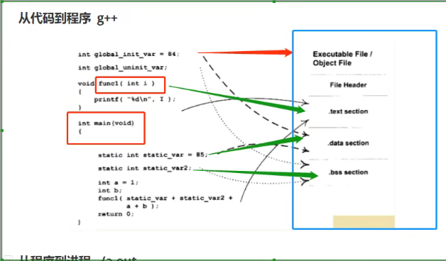
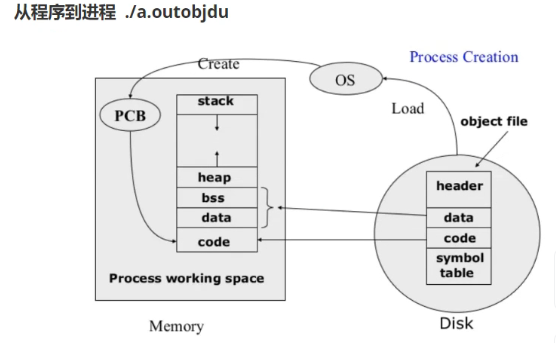
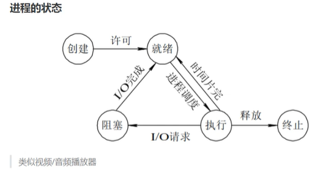

# Linux系统编程

主要内容

1. 详细 通俗易懂 生活化例子
2. 大厂 面试 百度 字节 阿里 腾讯
3. linux基础命令


## 1 进程基础

### 进程和程序

**什么是程序？**
- 广义 解决问题的逻辑集合 1-10 for print 先后顺序的
- 狭义 一个可执行的二进制文件 目标文件

**什么是进程？**
- 程序跑起来 程序的一次执行 执行的时候产生了一个进程！！执行结束的时候 进程就结束了
- 进程是操作系统**分配资源**的最小单位 内存 文件...资源

**线程** 线程是CPU调度的最小单位

**协程** 借助于线程实现，参考Golang 的 goroutine

**程序和进程的关系**

程序->菜谱->麻婆豆腐
进程->一盘麻婆豆腐

一个程序可以对应多个进程 程序

### 从代码到程序 g++



```shell
g++ test.cpp -c -o test.o # 编译汇编 Compile and assemble, but do not link.

readelf --help | head -5 # 查看readelf 文件帮助 显示前5行

yuancf1024@LAPTOP-22O3I9E3:~/cs/cpp-learn/linux/system-prog$ readelf -h test.o
ELF Header:
  Magic:   7f 45 4c 46 02 01 01 00 00 00 00 00 00 00 00 00 
  Class:                             ELF64
  Data:                              2's complement, little endian
  Version:                           1 (current)
  OS/ABI:                            UNIX - System V
  ABI Version:                       0
  Type:                              REL (Relocatable file)
  Machine:                           Advanced Micro Devices X86-64
  Version:                           0x1
  Entry point address:               0x0
  Start of program headers:          0 (bytes into file)
  Start of section headers:          1904 (bytes into file)
  Flags:                             0x0
  Size of this header:               64 (bytes)
  Size of program headers:           0 (bytes)
  Number of program headers:         0
  Size of section headers:           64 (bytes)
  Number of section headers:         16
  Section header string table index: 15

yuancf1024@LAPTOP-22O3I9E3:~/cs/cpp-learn/linux/system-prog$ objdump --help | head -5
Usage: objdump <option(s)> <file(s)>
 Display information from object <file(s)>.
 At least one of the following switches must be given:
  -a, --archive-headers    Display archive header information
  -f, --file-headers       Display the contents of the overall file header

yuancf1024@LAPTOP-22O3I9E3:~/cs/cpp-learn/linux/system-prog$ objdump -h test.o

test.o:     file format elf64-x86-64

Sections:
Idx Name          Size      VMA               LMA               File off  Algn
  0 .text         0000009d  0000000000000000  0000000000000000  00000040  2**0
                  CONTENTS, ALLOC, LOAD, RELOC, READONLY, CODE
  1 .data         00000000  0000000000000000  0000000000000000  000000dd  2**0
                  CONTENTS, ALLOC, LOAD, DATA
  2 .bss          00000001  0000000000000000  0000000000000000  000000dd  2**0
                  ALLOC
  3 .rodata       0000000d  0000000000000000  0000000000000000  000000dd  2**0
                  CONTENTS, ALLOC, LOAD, READONLY, DATA
  4 .init_array   00000008  0000000000000000  0000000000000000  000000f0  2**3
                  CONTENTS, ALLOC, LOAD, RELOC, DATA
  5 .comment      0000002c  0000000000000000  0000000000000000  000000f8  2**0
                  CONTENTS, READONLY
  6 .note.GNU-stack 00000000  0000000000000000  0000000000000000  00000124  2**0
                  CONTENTS, READONLY
  7 .note.gnu.property 00000020  0000000000000000  0000000000000000  00000128  2**3
                  CONTENTS, ALLOC, LOAD, READONLY, DATA
  8 .eh_frame     00000078  0000000000000000  0000000000000000  00000148  2**3
                  CONTENTS, ALLOC, LOAD, RELOC, READONLY, DATA

```

test.o 目标文件包含：
- Head 版本号
- .text
- .bss
- .rodata

- BSS（Block Started by Symbol）通常是指用来存放程序中**未初始化的全局变量和静态变量**的一块内存区域。特点是:**可读写的**，在程序执行之前BSS段会自动清0。所以，未初始的全局变量在程序执行之前已经成0了。

- 数据段：数据段（data segment）通常是指用来存放程序中**已初始化的全局变量**的一块内存区域。数据段属于**静态内存分配**。

- 代码段：代码段（code segment/text segment）通常是指用来**存放程序执行代码**的一块内存区域。这部分区域的大小在程序运行前就已经确定，并且内存区域通常属于**只读**, 某些架构也允许代码段为可写，即允许修改程序。在代码段中，也有可能包含一些只读的常数变量，例如字符串常量等。

- 堆（heap）：堆是用于存放进程运行中被**动态分配的内存段**，它的大小并不固定，可动态扩张或缩减。当进程调用malloc等函数分配内存时，新分配的内存就被动态添加到堆上（堆被扩张）；当利用free等函数释放内存时，被释放的内存从堆中被剔除（堆被缩减）

- 栈(stack)：栈又称堆栈， 是用户存放**程序临时创建的局部变量**，也就是说我们函数括弧“{}”中定义的变量（但不包括static声明的变量，static意味着在数据段中存放变量）。除此以外，在函数被调用时，其参数也会被压入发起调用的进程栈中，并且待到调用结束后，函数的返回值也会被存放回栈中。由于栈的先进先出特点，所以栈特别方便用来保存/恢复调用现场。从这个意义上讲，我们可以把堆栈看成一个**寄存、交换临时数据的内存区**


### 从程序到进程
- 第一步 操作系统加载程序到内存
- 第二步 操作系统为进程分配资源
- 第三步 创建PCB进程控制块 来了解你这个进程的状态 以及后续




### 进程的状态



> 类似视频/音频播放器

- 创建 
- 就绪 
- 执行  
- 阻塞 
  - IO阻塞模式 io操作 内核去处理 内核读写完成之后 通知进程 数据好了
- 终止 

### 如何查看进程

windows `tasklist`
Linux `ps`

- 进程命令的显示参数


|No.|标识|含义|
| - | - | - |
|   |   |   |
|   |   |   |
|   |   |   |
|   |   |   |
|   |   |   |
|   |   |   |
|   |   |   |
|   |   |   |
|   |   |   |
|   |   |   |

- 进程状态的标识
- 
|No.|标识|含义|
| - | - | - |
|   |   |   |
|   |   |   |
|   |   |   |
|   |   |   |
|   |   |   |
|   |   |   |
|   |   |   |
|   |   |   |
|   |   |   |
|   |   |   |


### 如何创建进程和杀死进程

### 并行和并发

### 虚拟地址空间

